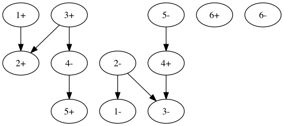

Compare assembly graph file formats
===================================

+ [ASQG](sample.asqg)
+ [GraphViz dot](sample.dot)
+ [GFA](sample.gfa)
+ [SAM](sample.sam)

Render `sample.dot` using GraphViz.

